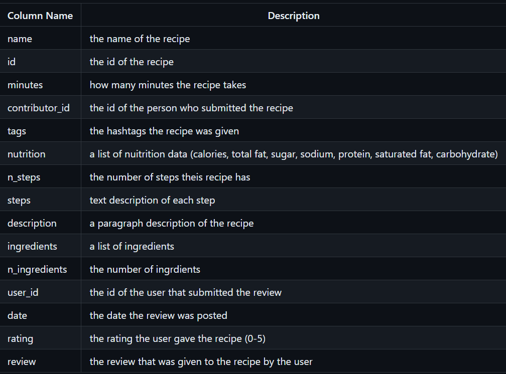

# Recipes Ratings RandomForestClassifier
By Wan-Rong (Emma) Leung and Camille Sicat

## Introduction
Our dataset is focused on recipes. Based on this data, we want to answer the question: What factors determine if a recipe is given a high rating? We want to answer this question so that when we search online recipe sites we can look at small details and determine if a recipe is good to follow. 

The first dataset we were given was 'recipes', which has 83782 rows and 12 columns.
## The recipes DataFrame

| name                                 |     id |   minutes |   contributor_id | submitted   | tags                                                                                                                                                                                                                                                                                               | nutrition                                     |   n_steps |    steps &nbsp;&nbsp;&nbsp;&nbsp;&nbsp;&nbsp;&nbsp;&nbsp;&nbsp;&nbsp;&nbsp;&nbsp;&nbsp;&nbsp;&nbsp;&nbsp;&nbsp;&nbsp;&nbsp;&nbsp;&nbsp;&nbsp;&nbsp;&nbsp;                                                                                                                                                                                                                                                                                                                                                                                                                                                                                                                                                                                                                                                                                                                                                                                                                                                                                                                                                                                                                                                                                                                                                                                                                                                                                                                                                                               | description                                                                                                                                                                                                                                                                                                                                                                       | ingredients                                                                                                                                                                                                                             |   n_ingredients |
|-------------------------------------|-------|----------|-----------------|------------|---------------------------------------------------------------------------------------------------------------------------------------------------------------------------------------------------------------------------------------------------------------------------------------------------|----------------------------------------------|----------|------------------------------------------------------------------------------------------------------------------------------------------------------------------------------------------------------------------------------------------------------------------------------------------------------------------------------------------------------------------------------------------------------------------------------------------------------------------------------------------------------------------------------------------------------------------------------------------------------------------------------------------------------------------------------------------------------------------------------------------------------------------------------------------------------------------------------------------------------------------------------------------------------------------------------------------------------------------------------------------------------------------------------------------------------------------------------------------------------------------------------------------------------------------------------------------------------------------------------------------------------------------------------------------------------------------------------------------------------------------------------------|----------------------------------------------------------------------------------------------------------------------------------------------------------------------------------------------------------------------------------------------------------------------------------------------------------------------------------------------------------------------------------|----------------------------------------------------------------------------------------------------------------------------------------------------------------------------------------------------------------------------------------|----------------|
| 1 brownies in the world    best ever | 333281 |        40 |           985201 | 2008-10-27  | ['60-minutes-or-less', 'time-to-make', 'course', 'main-ingredient', 'preparation', 'for-large-groups', 'desserts', 'lunch', 'snacks', 'cookies-and-brownies', 'chocolate', 'bar-cookies', 'brownies', 'number-of-servings']                                                                        | [138.4, 10.0, 50.0, 3.0, 3.0, 19.0, 6.0]      |        10 | ['heat the oven to 350f and arrange the rack in the middle', 'line an 8-by-8-inch glass baking dish with aluminum foil', 'combine chocolate and butter in a medium saucepan and cook over medium-low heat , stirring frequently , until evenly melted', 'remove from heat and let cool to room temperature', 'combine eggs , sugar , cocoa powder , vanilla extract , espresso , and salt in a large bowl and briefly stir until just evenly incorporated', 'add cooled chocolate and mix until uniform in color', 'add flour and stir until just incorporated', 'transfer batter to the prepared baking dish', 'bake until a tester inserted in the center of the brownies comes out clean , about 25 to 30 minutes', 'remove from the oven and cool completely before cutting']                                                                                                                                                                                                                                                                                                                                                                                                                                                                                                                                                                                                   | these are the most; chocolatey, moist, rich, dense, fudgy, delicious brownies that you'll ever make.....sereiously! there's no doubt that these will be your fav brownies ever for you can add things to them or make them plain.....either way they're pure heaven!                                                                                                              | ['bittersweet chocolate', 'unsalted butter', 'eggs', 'granulated sugar', 'unsweetened cocoa powder', 'vanilla extract', 'brewed espresso', 'kosher salt', 'all-purpose flour']                                                          |               9 |
| 1 in canada chocolate chip cookies   | 453467 |        45 |          1848091 | 2011-04-11  | ['60-minutes-or-less', 'time-to-make', 'cuisine', 'preparation', 'north-american', 'for-large-groups', 'canadian', 'british-columbian', 'number-of-servings']                                                                                                                                      | [595.1, 46.0, 211.0, 22.0, 13.0, 51.0, 26.0]  |        12 | ['pre-heat oven the 350 degrees f', 'in a mixing bowl , sift together the flours and baking powder', 'set aside', 'in another mixing bowl , blend together the sugars , margarine , and salt until light and fluffy', 'add the eggs , water , and vanilla to the margarine / sugar mixture and mix together until well combined', 'add in the flour mixture to the wet ingredients and blend until combined', 'scrape down the sides of the bowl and add the chocolate chips', 'mix until combined', 'scrape down the sides to the bowl again', 'using an ice cream scoop , scoop evenly rounded balls of dough and place of cookie sheet about 1 - 2 inches apart to allow for spreading during baking', 'bake for 10 - 15 minutes or until golden brown on the outside and soft & chewy in the center', 'serve hot and enjoy !']                                                                                                                                                                                                                                                                                                                                                                                                                                                                                                                                                  | this is the recipe that we use at my school cafeteria for chocolate chip cookies. they must be the best chocolate chip cookies i have ever had! if you don't have margarine or don't like it, then just use butter (softened) instead.                                                                                                                                            | ['white sugar', 'brown sugar', 'salt', 'margarine', 'eggs', 'vanilla', 'water', 'all-purpose flour', 'whole wheat flour', 'baking soda', 'chocolate chips']                                                                             |              11 |
| 412 broccoli casserole               | 306168 |        40 |            50969 | 2008-05-30  | ['60-minutes-or-less', 'time-to-make', 'course', 'main-ingredient', 'preparation', 'side-dishes', 'vegetables', 'easy', 'beginner-cook', 'broccoli']                                                                                                                                               | [194.8, 20.0, 6.0, 32.0, 22.0, 36.0, 3.0]     |         6 | ['preheat oven to 350 degrees', 'spray a 2 quart baking dish with cooking spray , set aside', 'in a large bowl mix together broccoli , soup , one cup of cheese , garlic powder , pepper , salt , milk , 1 cup of french onions , and soy sauce', 'pour into baking dish , sprinkle remaining cheese over top', 'bake for 25 minutes or until cheese is lightly browned', 'sprinkle with rest of french fried onions and bake until onions are browned and cheese is bubbly , about 10 more minutes']                                                                                                                                                                                                                                                                                                                                                                                                                                                                                                                                                                                                                                                                                                                                                                                                                                                                               | since there are already 411 recipes for broccoli casserole posted to "zaar" ,i decided to call this one  #412 broccoli casserole.i don't think there are any like this one in the database. i based this one on the famous "green bean casserole" from campbell's soup. but i think mine is better since i don't like cream of mushroom soup.submitted to "zaar" on may 28th,2008 | ['frozen broccoli cuts', 'cream of chicken soup', 'sharp cheddar cheese', 'garlic powder', 'ground black pepper', 'salt', 'milk', 'soy sauce', 'french-fried onions']                                                                   |               9 |
| millionaire pound cake               | 286009 |       120 |           461724 | 2008-02-12  | ['time-to-make', 'course', 'cuisine', 'preparation', 'occasion', 'north-american', 'desserts', 'american', 'southern-united-states', 'dinner-party', 'holiday-event', 'cakes', 'dietary', 'christmas', 'thanksgiving', 'low-sodium', 'low-in-something', 'taste-mood', 'sweet', '4-hours-or-less'] | [878.3, 63.0, 326.0, 13.0, 20.0, 123.0, 39.0] |         7 | ['freheat the oven to 300 degrees', 'grease a 10-inch tube pan with butter , dust the bottom and sides with flour , and set aside', 'in a large mixing bowl , cream the butter and sugar with an electric mixer and add the eggs one at a time , beating after each addition', 'alternately add the flour and milk , stirring till the batter is smooth', 'add the two extracts and stir till well blended', 'scrape the batter into the prepared pan and bake till a cake tester or knife blade inserted in the center comes out clean , about 1 1 / 2 hours', 'cool the cake in the pan on a rack for 5 minutes , then turn it out on the rack to cool completely']                                                                                                                                                                                                                                                                                                                                                                                                                                                                                                                                                                                                                                                                                                               | why a millionaire pound cake?  because it's super rich!  this scrumptious cake is the pride of an elderly belle from jackson, mississippi.  the recipe comes from "the glory of southern cooking" by james villas.                                                                                                                                                                | ['butter', 'sugar', 'eggs', 'all-purpose flour', 'whole milk', 'pure vanilla extract', 'almond extract']                                                                                                                                |               7 |
| 2000 meatloaf                        | 475785 |        90 |          2202916 | 2012-03-06  | ['time-to-make', 'course', 'main-ingredient', 'preparation', 'main-dish', 'potatoes', 'vegetables', '4-hours-or-less', 'meatloaf', 'simply-potatoes2']                                                                                                                                             | [267.0, 30.0, 12.0, 12.0, 29.0, 48.0, 2.0]    |        17 | ['pan fry bacon , and set aside on a paper towel to absorb excess grease', 'mince yellow onion , red bell pepper , and add to your mixing bowl', 'chop garlic and set aside', 'put 1tbsp olive oil into a saut pan , along with chopped garlic , teaspoons white pepper and a pinch of kosher salt', 'bring to a medium heat to sweat your garlic', 'preheat oven to 350f', 'coarsely chop your baby spinach add to your heated pan , stir frequently for approximately 5 min to wilt', 'add your spinach to the mixing bowl', 'chop your now cooled bacon , and add it to the mixing bowl', 'add your meatloaf mix to the bowl , with one egg and mix till thoroughly combined', 'add your goat cheese , one egg , 1 / 8 tsp white pepper and 1 / 8 tsp of kosher salt and mix till thoroughly combined', 'transfer to a 9x5 meatloaf pan , and cook for 60 min or until the internal temperature is at least 160f', 'let stand for 5min', 'melt 1tbsp unsalted butter into a frying pan , and cook up to three eggs at a time', 'crack each egg into a separate dish , in order to prevent egg shells from reaching the pan , then add salt and pepper to taste', 'wait until the egg whites are firm looking , but slightly runny on top before flipping your eggs', 'after flipping , wait 10~20 seconds before removing each egg and placing it over your slices of meatloaf'] | ready, set, cook! special edition contest entry: a mediterranean flavor inspired meatloaf dish. featuring: simply potatoes - shredded hash browns, egg, bacon, spinach, red bell pepper, and goat cheese.                                                                                                                                                                         | ['meatloaf mixture', 'unsmoked bacon', 'goat cheese', 'unsalted butter', 'eggs', 'baby spinach', 'yellow onion', 'red bell pepper', 'simply potatoes shredded hash browns', 'fresh garlic', 'kosher salt', 'white pepper', 'olive oil'] |              13 |

The other dataset we were given was 'interactions', which has 731927 rows and 5 columns.
## The interactions DataFrame

|    user_id |   recipe_id | date       |   rating | review                                                                                                                                                                                                                                                                                                                                                                                                                                                                                                                                                                                                                        |
|-----------:|------------:|:-----------|---------:|:------------------------------------------------------------------------------------------------------------------------------------------------------------------------------------------------------------------------------------------------------------------------------------------------------------------------------------------------------------------------------------------------------------------------------------------------------------------------------------------------------------------------------------------------------------------------------------------------------------------------------|
|    1293707 |       40893 | 2011-12-21 |        5 | So simple, so delicious! Great for chilly fall evening. Should have doubled it ;)  Second time around, forgot the remaining cumin. We usually love cumin, but didn't notice the missing 1/2 teaspoon!                                                                                                                                                                                                                                                                                                                                                                                                                 |
|     126440 |       85009 | 2010-02-27 |        5 | I made the Mexican topping and took it to bunko.  Everyone loved it.                                                                                                                                                                                                                                                                                                                                                                                                                                                                                                                                                          |
|      57222 |       85009 | 2011-10-01 |        5 | Made the cheddar bacon topping, adding a sprinkling of black pepper. Yum!                                                                                                                                                                                                                                                                                                                                                                                                                                                                                                                                                     |
|     124416 |      120345 | 2011-08-06 |        0 | Just an observation, so I will not rate.  I followed this procedure with strawberries instead of raspberries.  Perhaps this is the reason it did not work well.  Sorry to report that the strawberries I did in August were moldy in October.  They were stored in my downstairs fridge, which is very cold and infrequently opened.  Delicious and fresh-tasting prior to that, though.  So, keep a sharp eye on them.  Personally I would not keep them longer than a month.  This recipe also appears as #120345 posted in July 2009, which is when I tried it.  I also own the Edna Lewis cookbook in which this appears. |
| 2000192946 |      120345 | 2015-05-10 |        2 | This recipe was OVERLY too sweet.  I would start out with 1/3 or 1/4 cup of sugar and jsut add on from there.  Just 2 cups was way too much and I had to go back to the grocery store to buy more raspberries because it made so much mix.  Overall, I would but the long narrow box or raspberries.  Its a perfect fit for the recipe plus a little extra.  I was not impressed with this recipe.  It was exceptionally over-sweet.  If you make this simple recipe, MAKE SURE TO ADD LESS SUGAR!                                                                                                                            |

We merged these two datasets to get the 'recipes_and_interactions' dataframe. It contains 234429 rows and the columns 'name', 'id', 'minutes', 'contributor_id', 'submitted', 'tags', 'nutrition', 'n_steps', 'steps', 'description', 'ingredients', 'n_ingredients', 'user_id', 'date', 'rating', and 'review'. Of these columns, we are most interested in 'tags', 'n_steps', 'steps', 'n_ingredients', and 'rating'. See the table below for a detailed description of each column. 

### Data Cleaning and Exploratory Data Analysis
We started off with spliting all the values in nuitrition into new seperate columns (calories, total fat, sugar, sodium, protien, saturated fat, carbohydrate). By splitting them into seperate columns we were able to see if different segmants of nuitrition may have affects to the ratings. E.g. if higher calories food can lead to higher ratings. 

In the 'rating' column, we changed all values with rating of 0 to np.NaN. This is because if a review contained no rating, it was a missing rating, and thus further analysis must be done to determine why it is missing.

After this step, we created an 'average_rating' column, where each recipe has an average_rating based on the mean of all ratings given by reviewers. 
## The cleaned recipes_and_interactions DataFrame
<iframe
  src="assets/recipes_and_interactions.html"
  width="1000"
  height="600"
  frameborder="0"
></iframe>

For our univariate analysis, we decided to look at the distributin of the 'ratings' column. This is especially relevant because our model is predicting rating so we want to see what the distribution is like before we start training. The plot is heavily skewed left, towards 5-star ratings. 
## Distribution of Rating
<iframe
  src="assets/ratings_dist_plot.html"
  width="800"
  height="400"
  frameborder="0"
></iframe>

For our bivariate analysis we wanted to examine the relationship between number of ingredients ('n_ingredients') and number of steps ('n_steps'). 
## Number of Ingredients vs. Number of Steps
<iframe
  src="assets/ingredients_steps_scatter.html"
  width="800"
  height="400"
  frameborder="0"
></iframe>

As you can see above, there does not appear to be a relationship, as there is a large variation in number of steps in recipes with similar number of ingredients. 

For our aggregation, we wanted to see the distribution of 'calories (#)', 'n_ingredients', and 'n_steps', so we created the pivot table below with the aggregation method 'mean'. 
## Pivot Table of Recipe Data Means
<iframe
  src="assets/recipe_means.html"
  width="400"
  height="300"
  frameborder="0"
></iframe>

While mean is not the most illustrative measure of center, in the pivot table on average recipes with higher ratings have slightly more ingredients and slightly lower number of steps. That being said, because the data is relatively similar, it is unlikely that rating is influenced solely by these factors. More exploration is needed. 

### Assessment of Missingness
We have 4 columns with relevant proportions of missing data: 'description', 'review', 'rating', and 'average_rating'. Of these 4 columns, we believe that 'description' and 'review' are NMAR because users chose not to submit them because they didn't think they were relevant. 

Meanwhile, we believe that 'rating' or 'average_rating' is MAR. Below is the plot of our permutation test to see if 'average_rating' is MAR conditioned on 'n_steps'.
## 'average_rating' Conditioned on 'n_steps'
<iframe
  src="assets/avg_rating_steps_perm.html"
  width="800"
  height="400"
  frameborder="0"
></iframe>

For this plot, our p-value was 0.0, meaning the results are statistically significant. This also applies for our permutation test to see if 'average_rating' is MAR conditioned on 'n_ingredients'. 
## 'average_rating' conditioned on 'n_ingredients'
<iframe
  src="assets/avg_rating_ingredients_perm.html"
  width="800"
  height="400"
  frameborder="0"
></iframe>.

Finally, we ran a permutation test to see if 'average_rating' was MAR conditioned on another numerical column, 'sodium (PDV)'. In the permutation test below you can see that our results are not statistically significant. 
## 'average_rating' conditioned on 'sodium (PDV)'
<iframe
  src="assets/precision_difference_plot.html"
  width="800"
  height="400"
  frameborder="0"
></iframe>

Since 'average_rating' is MAR conditioned on 'n_steps' and 'n_ingredients', and 'average_rating' is based on 'rating', there is a high chance 'rating' is heavily related to 'n_steps' and 'n_ingredients'. We will use this information in our model. 

### Hypothesis Testing
For our hypothesis test, we wanted to answer the question: Do recipes with a higher number of ingredients have higher average ratings? 

We checked if recipes with a higher number of ingredients have the same average_ratings as recipes with a lower number of ingredients.

**Null hypothesis**: The distribution of average ratings for recipes with a high number of ingredients is the same as the distribution of average ratings for recipes with a low number of ingredients.
**Alternate hypothesis**: The distribution of average ratings for recipes with a high number of ingredients is different from the distribution of average ratings for recipes with a low number of ingredients.

For our test statistic we used the K-S statistic with a p-value cutoff of 0.05. 

Our test gave us a K-S statistic of 0.181 and a p-value of 1.4e-16. Based on these results, we reject our null hypothesis that the distribution of ratings for recipes with a high number of ingredients is the same as the distribution of ratings for recipes with a lower number of ingredients. This means 'n_ingredients' is significant for determining a recipe's rating, a fact we will use in our model. 

### Framing a Prediction Problem
For our prediction problem, we want to predict the rating of a recipe using a classification model. Both 'rating' (and 'average_rating') are heavily correlated with the numerical columns 'n_ingredients' and 'n_steps', meaning a relationship can be determined. Our classifier will be a multiclass classification model taking in these rows such as n_ingredients and n_steps to predict whether a recipe is 1, 2, 3, 4, or 5 stars. We will evaluate the effectiveness of our model using accuracy because it tells us whether or not the model was successful at predicting the correct category. We chose accuracy over the F-1 score because it is easier to interpet in the context of our question - that is, if a recipe has been classified as having a correct rating. 

At the time of classification, we can assume 'n_ingredients' and 'n_steps' would be known, so it is okay to use these as variables. 

### Baseline Model
For our baseline model we will use a DecisionTreeClassifier to classify our recipes data as having a rating of 1, 2, 3, 4, or 5 stars. In this baseline model, we are using the 2 quantative columns, 'n_steps' and 'n_ingriedients', to predict whether what rating a recipe will receive. To prevent outliers from skewing the data, we decided to standardize these columns with StandardScaler(). 

Our train/test split was the default 75%/25%. On training data across all 5 categories our model had an mean accuracy of ~77.4%. On testing data, across all 5 categories it had a mean accuracy of ~77.1%. 

We also tried a RandomForestClassifier, but the results were roughly the same as the DecisionTreeClassifier, so we used the DecisionTreeClassifier as our final baseline model. Because the training/testing accuracy scores of our DecisionTreeClassifier model are very similar, we believe we didn't overfit the data. Therefore, the high accuracy means our baseline model is good. That being said, we believe it can be improved by testing categorical columns and seeing if they improve our model's accuracy. 

### Final Model
To improve our model accuracy, we decided to introduce new variables. First, we engineered 2 new features: 'baking' and 'top three tags'. For 'baking', we thought that whether or not a recipe needed the extra prep time (as indicated by an oven) was an indicator of rating. For 'top three tags', the top 3 tags used on our recipes data were '60-minutes-or-less', '30-minutes-or-less', and '15-minutes-or-less'. If a recipe has popular tags, it means it was viewed by more people, meaning in our eyes it was more likely to have more ratings and thus more data to correlate. Then, we decided to use 'calories (#)', because oftentimes people will consider recipe quality through how many calories it introduces in the meal. We also decided not to scale 'n_steps' and 'n_ingredients' out of fear that scaling them last time reduced the quality of analysis.

For 'baking', we examined the nominal column 'steps', which have no inherent order as they are lists of strings. We assumed if the 'steps' column contained the word 'preheat' then the recipe involved an oven and thus 'baking'. We encoded this value using 1 to indicate 'baking' and 0 to indicate otherwise.

For 'tags', the top 3 tags '60-minutes-or-less', '30-minutes-or-less', and '15-minutes-or-less' have an inherent ordering, making this feature ordinal. To encode whether or not a reicpe fell into one of these three categories, we made a 2-dimensional matrix with each column representing a tag, with a 4th column for 'none of the above'. A 0 in one column meant the recipe did not fall under this category, and a 1 meant the recipe fell under the category. Note that we dropped the 'none of the above' column in our model analysis and tuning to avoid multicollinearity. 

'calories (#)' is a continuous quantiative column. For our model, we examined health data and determined that a recipe is considered high calorie if it contains over 600 calories, and low calorie otherwise. In the preprocessing step we used a Binarizer to encode this data. 

As stated earlier, we left 'n_steps' and 'n_ingredients' alone as they were numerical columns whose values were significant on their own to the problem at hand. 

To start the hyperparameter tuning process, we preprocessed the data to encode our given features. To better avoid overfitting given the increased complexity of our model, we decided to use a RandomForestClassifier with a 75%/25% train/test split. Our hyperparameters were 'max_depth' with values \[2,3,7\], 'min_samples_split' with values \[2, 5, 10\], and 'criterion' of \['gini', 'entropy'\]. We used GridSearchCV with five-fold cross-validation to determine that our best paramters were a criterion of 'entropy', a 'max_depth' of 7, and a 'min_samples_split' of 2. 

Using these hyperparameters, we created a RandomForestClassifier. On training data the model had a mean accuracy across all 5 categories of ~98.1%. On testing data it had a mean accuracy across all 5 categories of ~97.9%. Based on these dramatic improvement in accuracy across all 5 categories, we can see this RandomForestClassifier's performance is superior to our previous DecisionTreeClassifier. (To illustrate, see the confusion matrix below.)
## Confusion Matrix
<iframe
  src="assets/confusion_matrix.html"
  width="800"
  height="600"
  frameborder="0"
></iframe>

While we did use a RandomForestClassifier to avoid overfitting, it is posssible that it overfit to the training/test set. However, that cannot be tested without using more data. 

### Fairness Analysis

For our fairness analysis we chose whether or not the recipe require baking as our evaluation metric group. Whether or not a recipe require preheat indicates if this recipe requires baking. The evalutation matrix we chose is the Precision Parity, this is because our data would not be valid for accuracy parity since our predicting column (rating) is an imbalanced dataset, where we have significantly more 5 star ratings. Therefore, using accuracy parity might not lead to fair outcomes. 

Our Null and Alternative Hypothesis:

Null Hypothesis: Our model is fair. There is no difference in precision between recipe that require pre-heat and recipe that do not require preheat. And any observed difference is due to random chance. 

Alternative Hypothesis: Our model is not fair.There is a significant difference between the precision between recipe that require pre-heat and recipe that do not require preheat. And any observed difference is not due to chance. 

The test statistic we chose is the different in precision score across recipes that requires pre-heat and those that do not require pre-heat.

And the significant level we chose for our data is 0.05. And the resulting p-value that we got for our data is 0.07. Thus, this indicated that we fail to reject the null hypothesis, and that our data is fair. In addition, any observed differences could be due to random variation rather than a systematic difference in how well the model performs for individuals with and without preheat. All in all, we can conclude that under the case of precision parity our model performs similarly across the two groups. 

## Precision Difference Plot
<iframe
  src="assets/precision_difference.html"
  width="800"
  height="600"
  frameborder="0"
></iframe>
